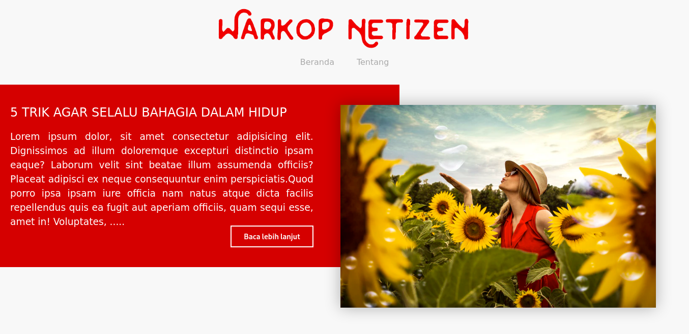

# NextJS+MDX Blog Example

This is a simple blog made using [NextJS](https://nextjs.org/) and [MDX](https://mdxjs.com/). This could be used as a starter project for those of you who learn how to use MDX and NextJS.

### Requirement

* [Yarn](https://yarnpkg.com/) 1.20+
* Internet connection

### How To Use

1. Clone or download the repo
2. Open the downloaded folder
3. Run `yarn` to install packages
4. Run `yarn dev` to start development server
5. Open browser then go to `http://localhost:3000`

### Photo Credits
* Red Dress Girl by [Andre Furtado](https://unsplash.com/photos/4Ttzoy1EQDs) (Unsplash)
* Snowboarding by [Felipe Giacometti](https://unsplash.com/photos/ziaGSKwdzn8) (Unsplash)
* Man Praying by [Artem Beliaikin](https://unsplash.com/photos/MVGwTsDfmes) (Unsplash)
* Volkswagen Beetle Lego by [Atish Sewmangel](https://unsplash.com/photos/NYbTdrBh740) (Unsplash)